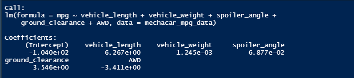
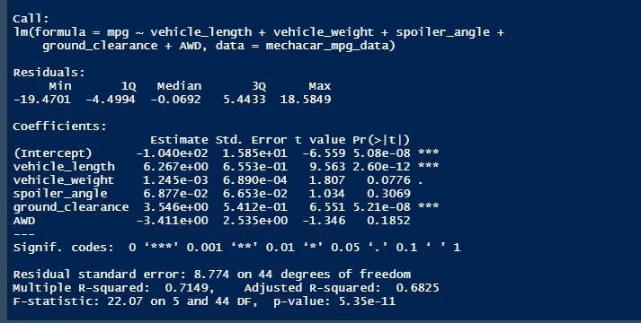
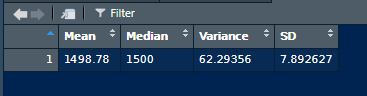
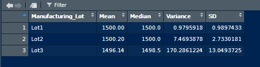
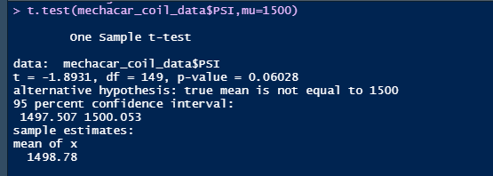
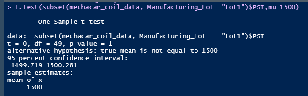
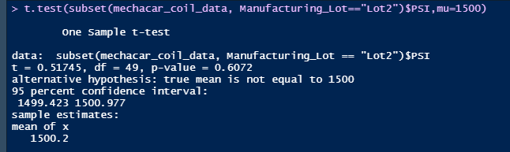
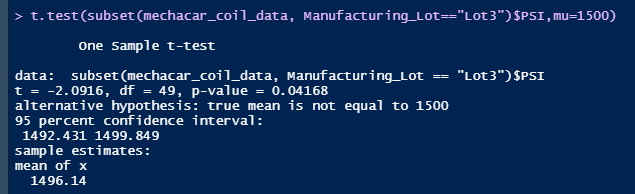

## Linear Regression to Predict MPG

Linear Regression model equation :

mpg = (6.267)vehicle_length + (0.001245)vehicle_weight + (0.06877)spoiler_angle + (3.546)ground_clearance + (-3.411)AWD + (-104.0)

### Summary

According to the above summary,

1. Since the Pr(>|t|) values of the variables _vehicle_length_ and _ground_clearance_ are too small comparied to other values, we can say that these two variables provide a non-random amount of variance to the **mpg** values in the dataset. In other words, they have a significant impact on mpg.

2. The slop of this linear model is not zero, because the _p-value_ for the model is 5.35e-11 and it is too small comparied to the significance level of 0.05, which means that we can reject null hypothesis with sufficient evidence.

3. Since the _Multiple R-squared_ value of the model is equal to 0.7149, we can say that the model predicts mpg of MechaCar prototypes effectively.

## Summary Statistics on Suspension Coils

_total summary_ dataframe:

_lot summary_ dataframe:

By considering the values in **total summary** dataframe, the variance of the suspension coils per square inch for all manufacturing lots in total is 62.29356 pounds and it is less than 100 pounds. So this meets the design specifications.

In the **lot summary** dataframe, we can see that the _Lot1_ and _Lot2_ have variances of the suspension coils per square inch 0.9795918 pounds and 7.4693878 pounds respectively. So these two lots meet the design specifications.

But the _Lot3_ doesn't meet the design specifications since its variance of the suspension coils per square inch is 170.2861224 pounds.

## T-Tests on Suspension Coils

T-Test results for all manufactuaring data:

The true mean of the sample is 1498.78 and it is same as our previous observation. Here, the _p-value_ is equal to 0.06028, which is higher than the significance level 0.05. Therefore we can't reject the null hypothesis with enough evidence.

As following screenshots show, the mean values of each sample is equal to the previously observed mean values.

T-Test results for _Lot1_

Here, the _p-value_ is equal to 1, which is much higher than the significance level 0.05. Therefore we can't reject the null hypothesis and must accept it.

T-Test results for _Lot2_

For this lot, the _p-value_ is equal to 0.06072, which is higher than the significance level 0.05. Therefore we can't reject the null hypothesis with enough evidence.

T-Test results for _Lot3_

For the third lot, the _p-value_ is 0.04168 and it is less than to the 0.05 level. Therefore we can reject the null hypothesis with enough evidence for this case.

## Study Design: MechaCar vs Competition

We can use many different statistical parameters to quantify how the MechaCar performs against the competition. As statistical metrics, we can use parameters selling price, maintainess cost, fuel efficiency and safety rating.

Here the null hypothesis is the "MechaCar is priced correctly according to the performence metrics".

As the statistical test, _multiple linear regression_ will be used, since it gives the correlation for each parameter and it allows us to identify the highest corelated parameters for the selling price of the car and will guide us to take the decision on null hypothesis.

To run the statistical test, we will need to collect the data about MechaCar and other competitors' cars in selling price, maintainess cost, fuel efficiency and safety rating feilds.
